# Домашнее задание №6

Описание/Пошаговая инструкция выполнения домашнего задания:

* Настройте выполнение контрольной точки раз в 30 секунд.
  > 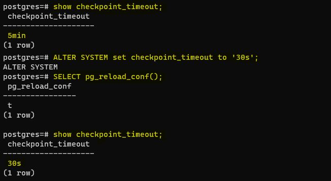
* 10 минут c помощью утилиты pgbench подавайте нагрузку.
   __*При просмотре статистики запросом (SELECT * FROM pg_stat_bgwriter \gx ) выводятся два счетчика:*__
   __*- checkpoints_timed — количество контрольных точек, созданных по расписанию (по достижению checkpoint_timeout).*__
   __*- checkpoints_req — количество контрольных точек, созданных по требованию (в том числе по достижению max_wal_size).*__
   __*Перед тем, как подать нагрузку утилитой pgbench на сервер, я очистил статистику bgwriter для того, чтобы было наглядно видно, сколько контрольных точек создастся во время нагрузки.*__
   __*Также фикcирую LSN (log sequence number), текущую позицию в фурнале.*__
  > 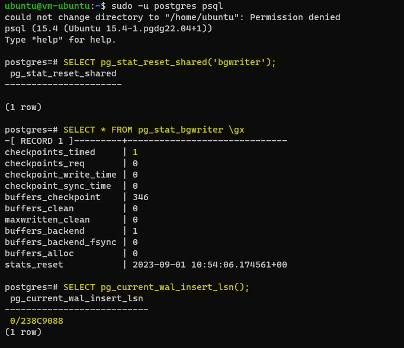
   __*После этого создаю нагрузку утилитой pgbench (pgbench -c8 -P 60 -T 600 -U postgres postgres)*__
   __*-c8 Количество моделируемых клиентов, т. е. количество одновременных сеансов базы данных.*__
   __*-P 60 Отображает отчет о ходе выполнения каждые 60 секунд.*__
   __*-T 600 Выполняет тест в течение этого количества секунд.*__
   __*-U postgres postgres Имя пользователя, к которому необходимо подключиться.*__
  > 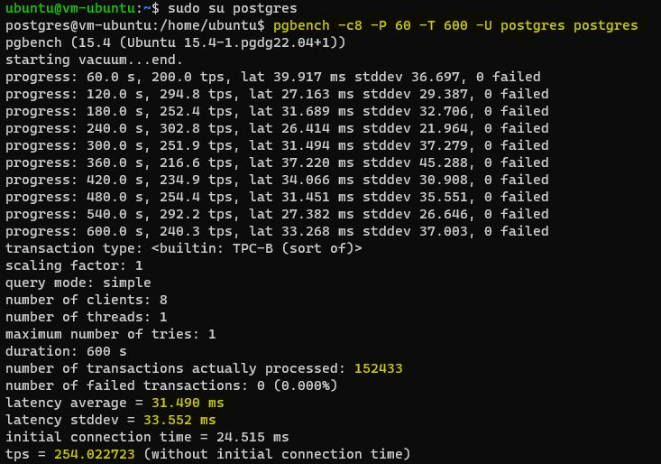
* Измерьте, какой объем журнальных файлов был сгенерирован за это время. Оцените, какой объем приходится в среднем на одну контрольную точку.
   __*После выполнения нагрузки посмотрел по счетчику checkpoints_timed количество созданных контрольных точек (22) и зафиксировал текущую позицию в журнале  (0/238C9088). Объем журнальных файлов, сгенерированных за время выполнения нагрузки 359 153 112. В среднем на одну контрольную точку приходится объем 17 957 655.*__
  > 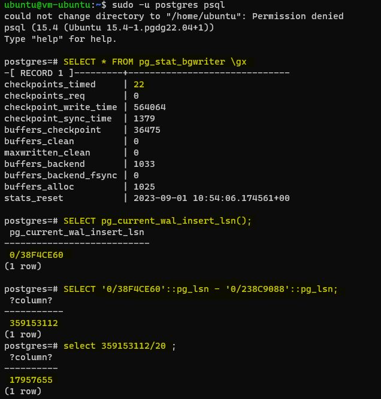
* Проверьте данные статистики: все ли контрольные точки выполнялись точно по расписанию. Почему так произошло?
   __*Для просмотра, в какое время выполнялись контрольные точки, выполнил команду «tail -n 50 /var/log/postgresql/postgresql-15-main.log».*__
  > 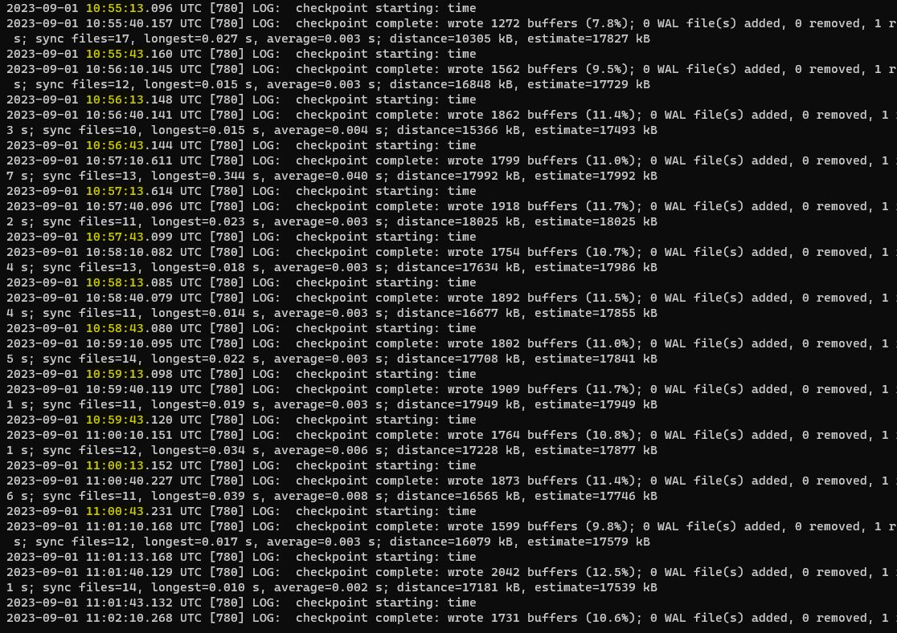
   __*Судя по логу, все контрольные точки выполнялись с шагом 30 секунд, как и было задано в параметре «checkpoint_timeout».
Могло случится так, что нагрузка была бы сильно выше, и за указанное в параметре «checkpoint_timeout» время сгенерировался бы слишком большой объем журнальных записей. В этом случае, если фактический объем будет получаться больше, чем значение, указанное в  параметре max_wal_size (общий допустимый объем журнальных файлов), то сервер инициировал бы внеплановую контрольную точку. В нашем случае max_wal_size  = 1Гб, и получается, что он не был превышен, раз за 10 минут создалось ровно 20 контрольных точек.*__  
  > 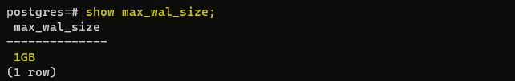
* Сравните tps в синхронном/асинхронном режиме утилитой pgbench. Объясните полученный результат.
   __*Установил асинхронный режим, потому что до этого запись журнала велась в синхронном режиме.*__
  > 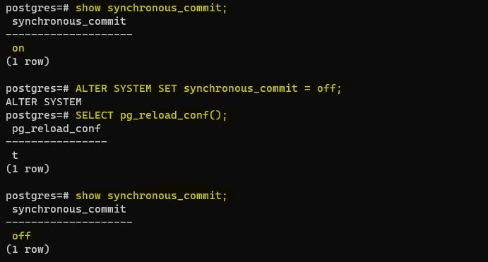
   __*Запись журнала происходит в одном из двух режимов:*__
   __*- синхронном — при фиксации транзакции продолжение работы невозможно до тех пор, пока все журнальные записи об этой транзакции не окажутся на диске;*__
   __*- асинхронном — транзакция завершается немедленно, а журнал записывается в фоновом режиме.*__
   __*При синхронной записи гарантируется долговечность (буква D в аббревиатуре ACID) — если транзакция зафиксирована, то все ее журнальные записи уже на диске и не будут потеряны. Обратная сторона состоит в том, что синхронная запись увеличивает время отклика (команда COMMIT не возвращает управление до окончания синхронизации) и уменьшает производительность системы. Асинхронная запись эффективнее синхронной — фиксация изменений не ждет записи. Однако надежность уменьшается: зафиксированные данные могут пропасть в случае сбоя, если между фиксацией и сбоем прошло менее 3 × wal_writer_delay времени (что при настройке по умолчанию составляет чуть больше полсекунды).*__
  > 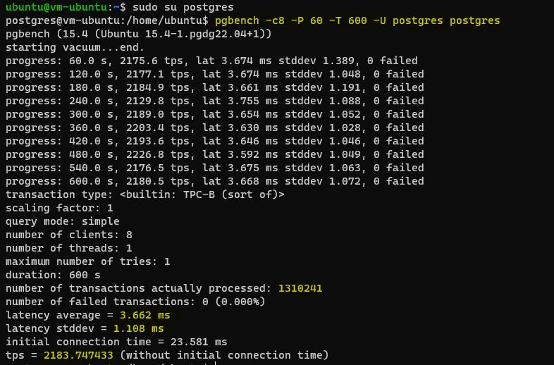
* Создайте новый кластер с включенной контрольной суммой страниц. Создайте таблицу. Вставьте несколько значений. Выключите кластер. Измените пару байт в таблице. Включите кластер и сделайте выборку из таблицы. Что и почему произошло? как проигнорировать ошибку и продолжить работу?
   __*Для включения контрольной суммы страниц нужно остановить кластер и убедиться, что Database cluster state в режиме shut down:*__
  > 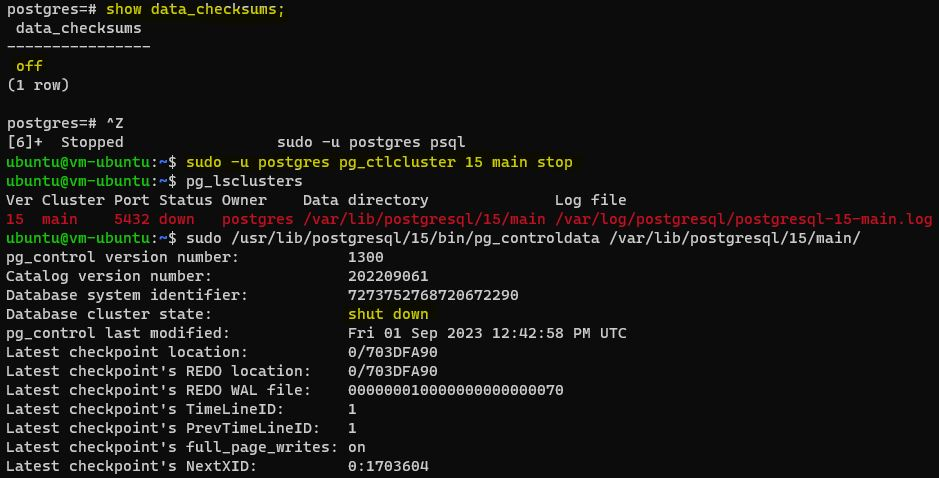
   __*С помощью pg_checksums включаю контрольную сумму страниц, затем запускаю кластер:*__
  > 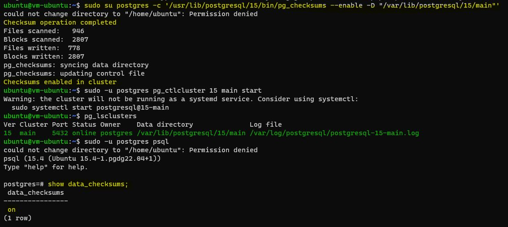
   __*Создаю таблицу test, наполняю ее тестовыми данными. Затем определяю OID таблицы test:*__
  > 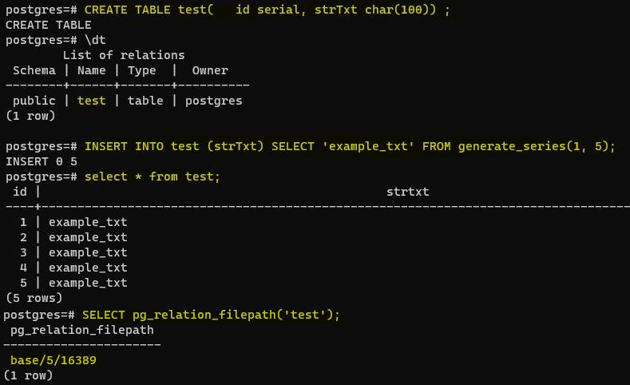
   __*Останавливаю кластер, изменяю пару байт в таблице, запускаю кластер и теперь получаю ошибку при обращении к таблице test:*__
  > 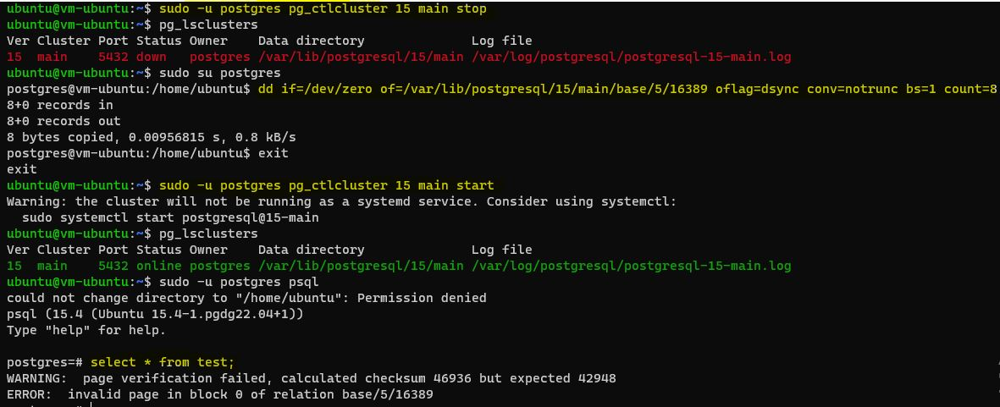
   __*Для того, чтобы снова можно было пользоваться таблицей test выполняю "SET zero_damaged_pages TO 'on'", после этого правда данные пропадают в данной таблице, зато ошибки нет:*__
  > 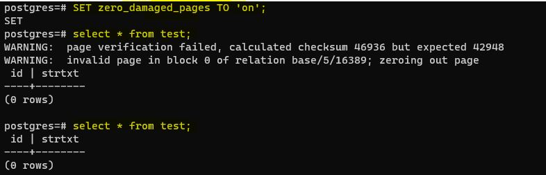

