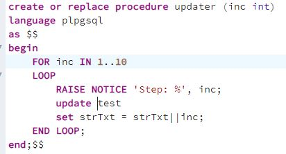

# Домашнее задание №6

Описание/Пошаговая инструкция выполнения домашнего задания:

* 1 Настройте выполнение контрольной точки раз в 30 секунд.

•	checkpoints_timed — по расписанию (по достижению checkpoint_timeout),
•	checkpoints_req — по требованию (в том числе по достижению max_wal_size).
Большое значение checkpoint_req (по сравнению с checkpoints_timed) говорит о том, что контрольные точки происходят чаще, чем предполагалось.
  > 

* 2 10 минут c помощью утилиты pgbench подавайте нагрузку.
  > 

pgbench -c8 -P 60 -T 600 -U postgres postgres
-c8 Количество моделируемых клиентов, т. е. количество одновременных сеансов базы данных
-P 60  Показывайте отчет о ходе выполнения каждые секунды
-T 600  Выполняйте тест в течение этого количества секунд, а не фиксированного количества транзакций на клиента.
-U postgres postgres  Имя пользователя, к которому необходимо подключиться

* 3 Измерьте, какой объем журнальных файлов был сгенерирован за это время. Оцените, какой объем приходится в среднем на одну контрольную точку.
SELECT * FROM pg_stat_bgwriter \gx --статистика
SELECT pg_current_wal_insert_lsn(); -- текущую позицию в журнале

pgbench -c8 -P 60 -T 600 -U postgres postgres 
-c8 Количество моделируемых клиентов, т. е. количество одновременных сеансов базы данных
-P 60  Показывайте отчет о ходе выполнения каждые секунды
-T 600  Выполняйте тест в течение этого количества секунд, а не фиксированного количества транзакций на клиента.
-U postgres postgres  Имя пользователя, к которому необходимо подключиться
SELECT pg_current_wal_insert_lsn(); -- текущую позицию в журнале

SELECT '0/38F4CE60'::pg_lsn - '0/238C9088'::pg_lsn;

postgres$ /usr/lib/postgresql/15/bin/pg_waldump -p /var/lib/postgresql/15/main/pg_wal -s 0/3514A14C

* 4 Проверьте данные статистики: все ли контрольные точки выполнялись точно по расписанию. Почему так произошло?
 __*Для просмотра, в какое время выполнялись контрольные точки выполнил команду «tail -n 50 /var/log/postgresql/postgresql-15-main.log».*__
 __*Судя по логу, все контрольные точки выполнялись с шагом 30 секунд, как и было задано в параметре «checkpoint_timeout».
Могло случится так, что нагрузка была бы сильно выше, и за указанное в параметре «checkpoint_timeout» время сгенерировался бы слишком большой объем журнальных записей. В этом случае, если фактический объем будет получаться больше,  чем значение указанное в  параметре max_wal_size (общий допустимый объем журнальных файлов), то сервер инициировал бы внеплановую контрольную точку. В нашем случае max_wal_size  = 1Гб, и получается, что он не был превышен, раз за 10 минут создалось ровно 20 контрольных точек.*__
* 5 Сравните tps в синхронном/асинхронном режиме утилитой pgbench. Объясните полученный результат.
Запись журнала происходит в одном из двух режимов:
•	синхронном — при фиксации транзакции продолжение работы невозможно до тех пор, пока все журнальные записи об этой транзакции не окажутся на диске;
•	асинхронном — транзакция завершается немедленно, а журнал записывается в фоновом режиме.
При синхронной записи гарантируется долговечность (буква D в аббревиатуре ACID) — если транзакция зафиксирована, то все ее журнальные записи уже на диске и не будут потеряны. Обратная сторона состоит в том, что синхронная запись увеличивает время отклика (команда COMMIT не возвращает управление до окончания синхронизации) и уменьшает производительность системы. Асинхронная запись эффективнее синхронной — фиксация изменений не ждет записи. Однако надежность уменьшается: зафиксированные данные могут пропасть в случае сбоя, если между фиксацией и сбоем прошло менее 3 × wal_writer_delay времени (что при настройке по умолчанию составляет чуть больше полсекунды).
* 6 Создайте новый кластер с включенной контрольной суммой страниц. Создайте таблицу. Вставьте несколько значений. Выключите кластер. Измените пару байт в таблице. Включите кластер и сделайте выборку из таблицы. Что и почему произошло? как проигнорировать ошибку и продолжить работу?

